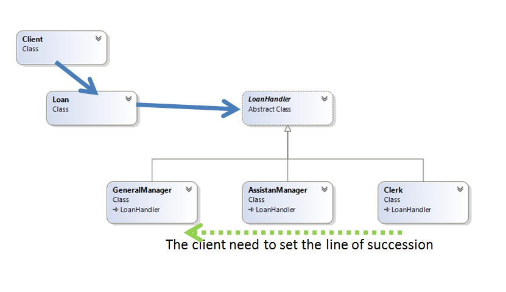

# Chain of Responsibility
### Behavioral Design Pattern

## Описание
Когато пишем приложения от най-различен тип, често се налага някое събитие генерирано от даден обект да бъде обработено от друг обект.

В тези случаи може да използваме шаблона за дизайн Chain of Responsibility. Той ни позволява да изпратим команда, без да знаем предварително кой точно обект ще я изпълни.  

Предварително условие за това е всички обекти които биха могли да изпълнят командата ни да пазят референция един към друг, за да може да си прехвърлят заявката докато някой успее да я изпълни. 

Chain of Responsibility ни позволява да разкачим дадена заявка от това кой точно ще я изпълни, давайки ни по-голяма гъвкавост, да достигнем до най-подходящия "Handler".

Най-големия недостатък на този шаблон за дизайн е, че много лесно може да бъде "счупен", ако например програмистта който го имплементира забрави да добави връзка за следващия Handler на дадена заявка.

## Implemntation
Кратко демо за отпускането на кредити

###### internal class Loan – базов клас който съдържа баязови детайли за самия кредит
~~~c#
internal class Loan
    {
        public Loan(string purpose, decimal amount)
        {
            this.Purpose = purpose;
            this.Amount = amount;
        }

        public string Purpose { get; set; }

        public decimal Amount { get; set; }        
    }
~~~

###### internal abstract class LoanHandler т.нар. Handler клас. Съдържа в себе си референция към наследника си, както създава метод с който той може да бъде определян. Задава базовите методи които трябва да се имплементират от неговите наследници.
~~~c#
internal abstract class LoanHandler
    {
        protected LoanHandler Successor { get; set; }

        public void SetSuccessor(LoanHandler successor)
        {
            this.Successor = successor;
        }

        public abstract void ApproveRequest(Loan loanRequest);
    }
~~~

###### internal class Clerk - т.нар. Concrete Handler клас, задава правилата при които може да изпълни дадена заявка, ако не успее я прехвърля на следващия по веригата клас.
~~~c#
internal class Clerk : LoanHandler
    {
        private const decimal ApproveLimit = 10000M;

        public override void ApproveRequest(Loan loanRequest)
        {
            if (loanRequest.Amount < ApproveLimit)
            {
                Console.WriteLine("Approved {0:C2} loan for {1} by the Bank {2}", loanRequest.Amount, loanRequest.Purpose, this.GetType().Name);                  
            }
            else if (this.Successor != null)
            {
                this.Successor.ApproveRequest(loanRequest);
            }
        }
    }
~~~

###### Използване от страна на клиента - На първо място трябва да създаде йерархията по която да бъдат прехвърляни всички заявки. След това всяка една заявка може да бъде адресирана към класа с най-ниска отговорност, но тя да бъде изпълнявана само от обектите които имат правомощията за това.
~~~c#
public class Client
    {
        public static void Main()
        {
            LoanHandler lowLevelClerk = new Clerk();
            LoanHandler midLevelManager = new AssistanManager();
            LoanHandler topExecuive = new GeneralManager();

            lowLevelClerk.SetSuccessor(midLevelManager);
            midLevelManager.SetSuccessor(topExecuive);

            var loan = new Loan("New Laptop", 1999);
            lowLevelClerk.ApproveRequest(loan);

            loan = new Loan("Fancy Sport Car", 180000);
            lowLevelClerk.ApproveRequest(loan);

            loan = new Loan("House in Miami", 1750000);
            lowLevelClerk.ApproveRequest(loan);

            loan = new Loan("Shiny Yacht", 12000000);
            lowLevelClerk.ApproveRequest(loan);
        }
    }
~~~

###### [Link to GitHub](https://github.com/mdraganov/Telerik-Academy/blob/master/HQC/Behavioral-Patterns/chainOfResponsibility.md)
