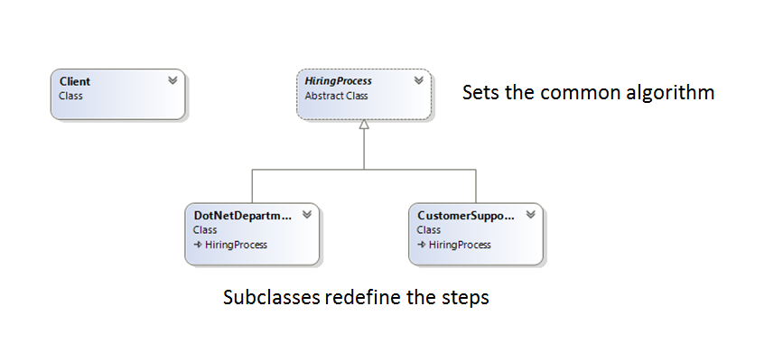

# Тemplate Method
### Behavioral Design Pattern

## Описание
Този шаблон за дизайн се използва когато имаме даден алгоритъм който изпълнява дадена задача в определена последователност, но част от стъпките могат да се изпълняват по различен начин в зависимост от имплементацията. Това може да бъде постигнато с наследяване, вместо с имплементирането на Strategy Pattern.

При ползването на Тemplate Method имаме определен скелет на един алгоритъм при дадена операция, отстъпвайки някои стъпки за имплементиране от подкласове. Те от своя страна предефинират някои стъпки, но без да се променя цялостната структурата на алгоритъма.

## Implemntation
Кратко демо за провеждането на процедура по подбор на персонал

###### public abstract class HiringProcess - това е темплейния клас който задава базовия алгоритъм по назначаване на персонал. Метода HirePerson() дефинира стъпките по които се изпълнява този процес. Абстрактните методи ще бъдат имплементирани в зависимост от конкретните изисквания на наследниците (различните отдели). Част от методите, които са общи могат да бъдат дефинирани тук. 
~~~c#
public abstract class HiringProcess
    {
        public void HirePerson()
        {
            this.FirstRoundTest();
            this.CaseSolving();
            this.HRInterview();
        }

        protected abstract void CaseSolving();

        protected abstract void FirstRoundTest();

        private void HRInterview()
        {
            Console.WriteLine("Interview with the HR and Department Managers");
        }
    }
~~~

###### public class CustomerSupportDepartment - създава собствени правила за изпълнение на стъпките по набиране на персонал в зависимост от конкретните изисквания за този отдел. Не променя цялостния алгоритъм и последователността на изпълняваните стъпки
~~~c#
public class CustomerSupportDepartment : HiringProcess
    {
        protected override void CaseSolving()
        {
            Console.WriteLine("Writing an article about Communication with difficult clients");
        }

        protected override void FirstRoundTest()
        {
            Console.WriteLine("Conducted Test in English");
        }
    }
~~~

###### public class DotNetDepartment - аналогичен е с класа CustomerSupportDepartment 
~~~c#
public class DotNetDepartment : HiringProcess
    {
        protected override void CaseSolving()
        {
            Console.WriteLine("Implementing Template method design pattern");
        }

        protected override void FirstRoundTest()
        {
            Console.WriteLine("Taking a tricky test in C#");
        }
    }
~~~

###### Използване от страна на клиента - в зависимост от своите нужди създава необходимата му инстанция, която да изпълни процеса по набиране на персонал
~~~c#
public class Client
    {
        public static void Main()
        {
            Console.WriteLine("--- How to hire Developer ---");
            HiringProcess newDev = new DotNetDepartment();
            newDev.HirePerson();

            Console.WriteLine("--- How to hire Customer Support ---");
            HiringProcess newSupport = new CustomerSupportDepartment();
            newSupport.HirePerson();
        }
    }
~~~

###### [Link to GitHub]() 
