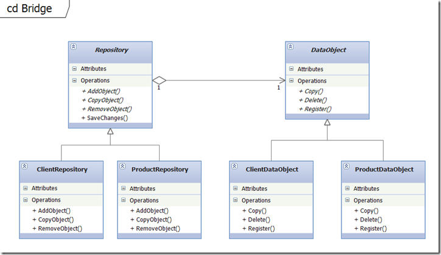

# Structural Design Patterns 
## Bridge

### Кратко описание

Bridge се използва, за да разделя абстракцията и имплементацията на две отделни йерархии от класове , така че да може да се променят независимо един от друг.
Bridge има почти същата структура като Adapter шаблона. Но той се използва, когато разработваме нови системи, а Adapter се използва във вече съществуващи системи.

Пример за този модел е използването на плъгини или драйвер. Ако имаме приложение, което може да работи с различни специфични драйвери, тогава можем да използваме Bridge модел. Класически пример за сценарий, при който този модел може да се използва, е в екрана Video Configuration на играта "Half-life". Този екран дава на играча възможност да стартира играта в OpenGL, Direct3D или режим софтуер. Когато играчът направи своя избор, той ще използва конкретната имплементация на съответния режим, без изобщо да влияе на абстракцията.

Тук ще разгледаме конкретен пример за Bridge модел, в който BusinessObject абстракция е отделена от имплементацията в DataObject. Реализациите на DataObject могат да се развиват динамично, без изобщо да се променят клиентите.

### Имплементация

###### Repository

	public abstract class Repository
    {        
        public abstract void AddObject(DataObject dataObject);
        public abstract void CopyObject(DataObject dataObject);
        public abstract void RemoveObject(DataObject dataObject);
 
        public void SaveChanges()
        {
            Console.WriteLine("Changes were saved");
        }
    }

###### ClientRepository

    public class ClientRepository : Repository
    {
        public override void AddObject(DataObject dataObject)
        {
            // Do repository specific work
            dataObject.Register();            
        }
 
        public override void CopyObject(DataObject dataObject)
        {
            // Do repository specific work
            dataObject.Copy();            
        }
 
        public override void RemoveObject(DataObject dataObject)
        {
            // Do repository specific work
            dataObject.Delete();            
        }
    }

###### ProductRepository
 
    public class ProductRepository : Repository
    {
        public override void AddObject(DataObject dataObject)
        {
            // Do repository specific work
            dataObject.Register();
        }
 
        public override void CopyObject(DataObject dataObject)
        {
            // Do repository specific work
            dataObject.Copy();
        }
 
        public override void RemoveObject(DataObject dataObject)
        {
            // Do repository specific work
            dataObject.Delete();
        }
    }

###### DataObject

    public abstract class DataObject
    {
        public abstract void Register();
        public abstract DataObject Copy();
        public abstract void Delete();
    }

###### ClientDataObject
 
    public class ClientDataObject : DataObject
    {
        public override void Register()
        {
            Console.WriteLine("ClientDataObject was registered");
        }
 
        public override DataObject Copy()
        {
            Console.WriteLine("ClientDataObject was copied");
            return new ClientDataObject();
        }
 
        public override void Delete()
        {
            Console.WriteLine("ClientDataObject was deleted");
        }
    }

###### ProductDataObject
 
    public class ProductDataObject : DataObject
    {
        public override void Register()
        {
            Console.WriteLine("ProductDataObject was registered");
        }
 
        public override DataObject Copy()
        {
            Console.WriteLine("ProductDataObject was copied");
            return new ProductDataObject();
        }
 
        public override void Delete()
        {
            Console.WriteLine("ProductDataObject was deleted");
        }
    }

###### Bridge
    
    public static void Bridge()
    {
        var clientRepository = new ClientRepository();
        var productRepository = new ProductRepository();
 
        var clientDataObject = new ClientDataObject();
        clientRepository.AddObject(clientDataObject);
        clientRepository.SaveChanges();
 
        clientRepository.CopyObject(clientDataObject);
            
        clientRepository.RemoveObject(clientDataObject);
        clientRepository.SaveChanges();
 
        var productDataObject = new ProductDataObject();
        productRepository.AddObject(productDataObject);
        clientRepository.SaveChanges();
            
        productRepository.CopyObject(productDataObject);
            
        productRepository.RemoveObject(productDataObject);
        productRepository.SaveChanges();
 
        Console.ReadKey();
    }

### UML Диаграма

