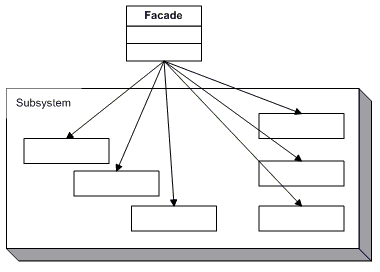

# Structural Design Patterns 
## Façade

### Кратко описание

Има случаи, когато трябва да работим с поредица от обекти за извършване на определена задача. Например, ако пишем софтуер за универсално дистанционно и искаме да изключим едновременно всички устройства, имаме няколко опции. Първо можем да изберем устройствата поотделно и да ги изключим едно по едно. Това явно е неудобно, затова ще опитаме друг подход. Например може да има един бутон, който да изключва всички устройства. Ако натиснем бутона дистанционното ще се свърже с всички устройства и ще ги изключи.

Има още един подход при проектирането на това решение. Защо да няма обект, чиято отговорност е да спре всички устройства. Сега, когато имаме нужда да спрем всички устройства, ще трябва да се обадим само на този обект. Това е точно философията на модела Façade, който осигурява единен интерфейс за набор от интерфейси в подсистема. Façade дефинира интерфейс по-високо ниво, което прави подсистемата лесно за използване."

### Имплементация

###### Facade

	namespace DesignPatterns
	{
	    using System;
	
	    /// 

	    /// MainApp startup class for Real-World 
	    /// Facade Design Pattern.
	    /// 

	    class Facade
	    {
	        /// 

	        /// Entry point into console application.
	        /// 

	        public static void Main()
	        {
	            // Facade
	            Mortgage mortgage = new Mortgage();
	
	            // Evaluate mortgage eligibility for customer
	            Customer customer = new Customer("Evgeni Ivanov");
	
	            bool eligible = mortgage.IsEligible(customer, 100000);
	
	            Console.WriteLine("\n" + customer.Name +
	                " has been " + (eligible ? "Approved" : "Rejected"));
	
	            // Wait for user
	            Console.ReadKey();
	        }
	    }
	
	    /// 

	    /// The 'Subsystem ClassA' class
	    /// 

	    class Bank
	    {
	        public bool HasSufficientSavings(Customer c, int amount)
	        {
	            Console.WriteLine("Check bank for " + c.Name);
	            return true;
	        }
	    }
	
	    /// 

	    /// The 'Subsystem ClassB' class
	    /// 

	    class Credit
	    {
	        public bool HasGoodCredit(Customer c)
	        {
	            Console.WriteLine("Check credit for " + c.Name);
	            return true;
	        }
	    }
	
	    /// 

	    /// The 'Subsystem ClassC' class
	    /// 

	    class Loan
	    {
	        public bool HasNoBadLoans(Customer c)
	        {
	            Console.WriteLine("Check loans for " + c.Name);
	            return true;
	        }
	    }
	
	    /// 

	    /// Customer class
	    /// 

	    class Customer
	    {
	        private string _name;
	
	        // Constructor
	        public Customer(string name)
	        {
	            this._name = name;
	        }
	
	        // Gets the name
	        public string Name
	        {
	            get { return _name; }
	        }
	    }
	
	    /// 

	    /// The 'Facade' class
	    /// 

	    class Mortgage
	    {
	        private Bank _bank = new Bank();
	
	        private Loan _loan = new Loan();
	
	        private Credit _credit = new Credit();
	
	        public bool IsEligible(Customer cust, int amount)
	        {
	            Console.WriteLine("{0} applies for {1:C} loan\n",
	              cust.Name, amount);
	
	            bool eligible = true;
	
	            // Check creditworthyness of applicant
	            if (!_bank.HasSufficientSavings(cust, amount))
	            {
	                eligible = false;
	            }
	            else if (!_loan.HasNoBadLoans(cust))
	            {
	                eligible = false;
	            }
	            else if (!_credit.HasGoodCredit(cust))
	            {
	                eligible = false;
	            }
	
	            return eligible;
	        }
	    }
	}

 

### UML Диаграма

